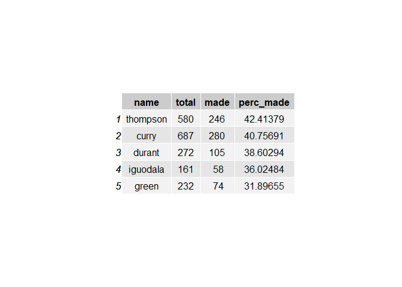

Workout 1
================
Anna Bardin
March 12, 2019

Bringing on Kevin Durant: How does he Compare to Other Notable Warriors Players?
================================================================================

This 2016 season, the Golden State Warriors landed Kevin Durant, former MVP and four-time scoring champion, solidifying the teams reputation as one of the biggest power houses in the league. Prior to Durant's acquisition, the Warriors had already set records, winning 73 games during the 2015 season, but falling short of winning the NBA championship. With the team's already strong core of players, fans were hoping that this addition will bring the team a championship, and they were correct.

Introduction and Methods
------------------------

In this report, we used the shot data of five of the most important players of the Golden State Warrirors during the 2016-2017 season. The players chosen were Stephen Curry, Kevin Durant, Draymond Green, Andre Iguodala, and Klay Thompson. In this analysis, we used only the shot data of these players, ignoring other factors such as defense and assists, in order to most simply visualize the effectiveness of the Warrior's Offense.

Motivation
----------

My purpose for conducting this study is to compare the shooting statistics of the five most notable Golden State Warriors players. To do this, I made several different visual representations of the data I was given about their respective shooting statistics which I analyzed for obvious patterns and trends

Data
----

The data used in this report involves the shot data for five players: Kevin Durant, Andre Iguodala, Klay Thompson, Stephen Curry, Draymond Green. The original data I used has columns for the team name, game data, season, periods, minutes and seconds remaining when the shots were made, whether or not the shot was made, actin type of the shot,the point value of the shot, the opponent, and the coordinates on the court that the shot was made. Our analysis mostly involved the physical location, point value of the shot, and whether or not the shot was made.

Analysis
--------

First, we can look at percent effective shooting tables of the five players for three pointers, two pointers, and combined points.

    ## Warning: package 'gridExtra' was built under R version 3.5.3

As evidenced by this chart, for overall points made Kevin Durant has the highest success rate out of the team. Meanwhile, Thompson and Curry-regarded as some of the best shooters in the league-have a higher number of total shots, Durant comes in third with an overall 915 shots made.

With the addition of Durant, the Warrior's overall percent made for both two point shots and three point shots increased. In the case of two point shots, Durant is in the lead for total shots taken, with Curry and Thompson in a close second and third. However, in terms of highest percent effectiveness, Iguodala is the most effective, with Durant in second. For effective shooting of three point shots, Thompson, Curry, and Durant have the first, second, and third most effective shots, in that order. However, unlike the two point shot data, for the total three points shots taken, Durant has only taken 272 shots, far behind the 580 and 687 taken by Thompson and Curry respectively.

### Shot Charts

First, look at the shot charts of the standing position of shooting for five players. From these charts, we can see that compared to green and iguodala, thompson, durant and curry all have a higher rate of total shots. Moreover, out of these it visually appears that Durant, Curry, and Thompson all have the most diverse shooting spots, shooting from areas all across the court. While, at first glance it appears that stephen curry has the best shot record, it is important to note that we need to take into account other very important factors such as shot times and defense.

Conclusion
----------

To conclude, adding Kevin Durant to the Golden State Warriors was a good addition as evidenced by the shot data. Durant consistently comes out in the top few players on the team for all the categories we examined: two point shots, three point shots, and total shots. Moreover, by watching a game, it is clear that Durant makes points indirectly through assists, but additional data would be need to statistically prove this.
